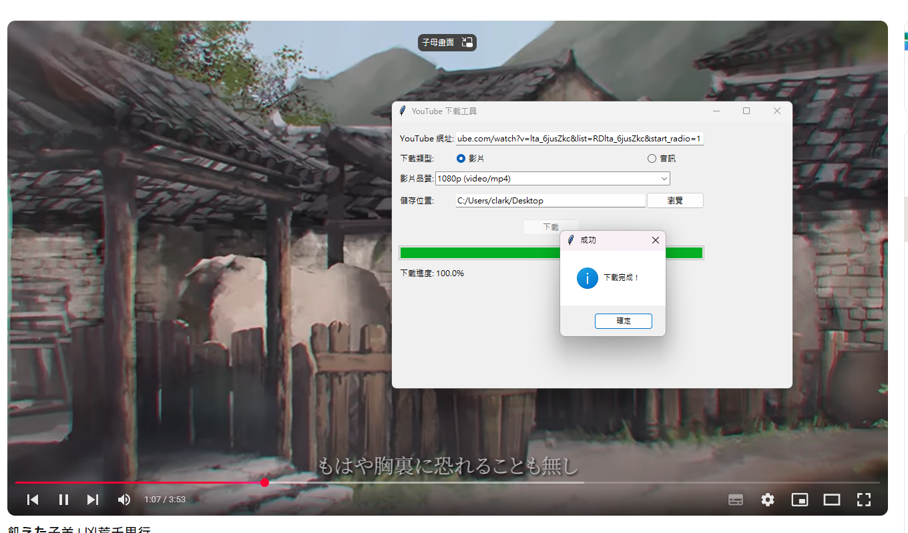

# YouTube 下載工具 / YouTube Downloader Tool

這是一個使用 `Tkinter` 和 `pytubefix` 所開發的桌面應用程式，支援從 YouTube 下載影片或音訊檔案，並可選擇儲存路徑與影片品質。若影片品質為 720p 或以上，將自動使用 FFmpeg 合併影音檔案。

This is a desktop GUI tool built with `Tkinter` and `pytubefix` for downloading videos or audio from YouTube. It supports saving to a specified path and selecting video quality. For videos in 720p or higher, FFmpeg is used to merge audio and video.

---

## 📌 功能特色 / Features

- 🎬 支援下載影片（可選擇高品質）
- 🎵 支援下載音訊（自動轉為 MP3）
- 📁 可選擇儲存位置
- 📶 顯示下載進度
- ⚙ 自動使用 FFmpeg 合併高畫質影片與音訊（720p+）

---

## 🔧 安裝與使用 / Installation & Usage

### ✅ 系統需求 / Requirements

- Python 3.10+
- [FFmpeg](https://ffmpeg.org/download.html)（需加入環境變數或調整 `download()` 中的路徑）
- 套件依賴：
  - `pytubefix`
  - `tkinter`（Python 內建）
  
### 📦 安裝套件 / Install dependencies

```bash
pip install pytubefix
```

### 🚀 執行程式 / Run the application

```bash
python your_script_name.py
```

### 🛠 FFmpeg 設定 / FFmpeg Configuration

請確認 ffmpeg 可執行檔已安裝，並修改以下程式碼中 ffmpeg 路徑：

```python
cmd = [
    ".\\ffmpeg",  # 或完整路徑，例如：C:\\ffmpeg\\bin\\ffmpeg.exe
    ...
]
```

### 📸 使用畫面 / Screenshots



### ❗ 注意事項 / Notes
- 音訊下載會自動轉為 .mp3 格式。
- 若影片高於 720p，會下載影片與音訊後合併，需使用 FFmpeg。
- 若遇錯誤，請確認 YouTube 網址正確並可連線。

### 📝 授權 / License
MIT License - Feel free to use, modify and share.

### 🙌 作者 / Author
Developed by Clark1945