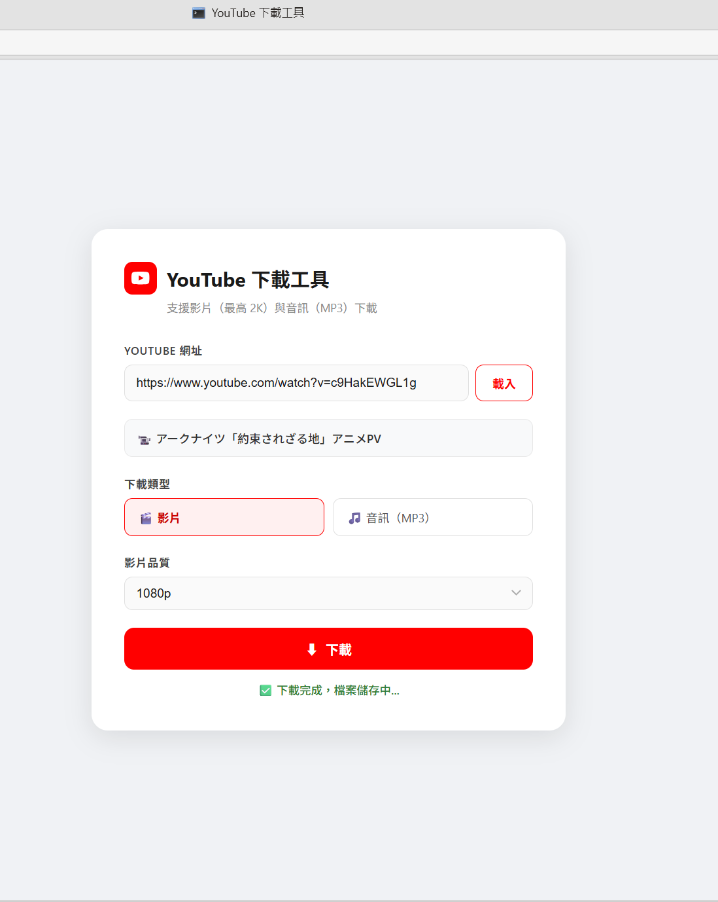
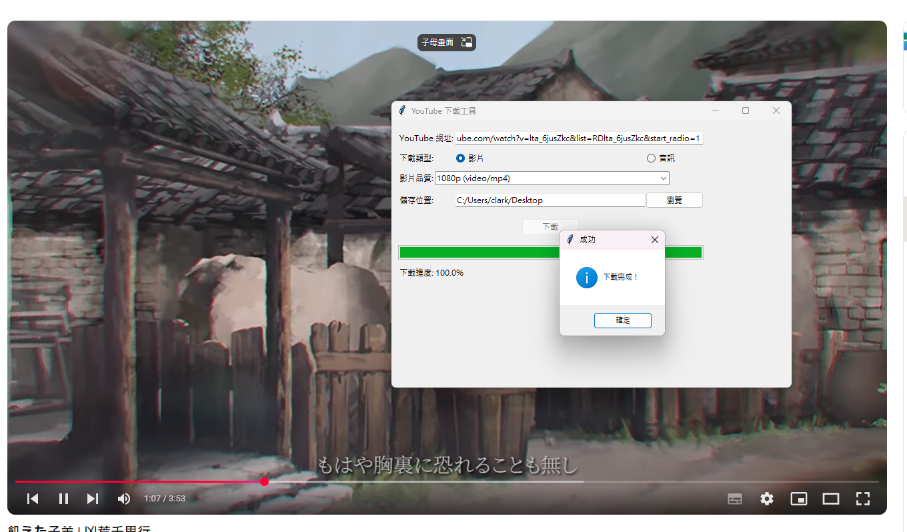

<div align="center">



# YouTube 下載工具 / YouTube Downloader / YouTube ダウンローダー

**中文** | **English** | **日本語**

[](https://www.python.org/)
[](https://flask.palletsprojects.com/)
[](LICENSE)

</div>

---

Live Demo: https://youtube-downloader.clarkliu.com

## 📖 簡介 / About / 概要

**中文**
> 基於 Flask 開發的 YouTube 影片下載 Web 應用程式，支援影片（最高 2K）與音訊（MP3）下載，具備登入驗證保護。

**English**
> A Flask-based YouTube downloader web app supporting video (up to 2K) and audio (MP3) downloads, with login authentication.

**日本語**
> Flask ベースの YouTube 動画ダウンロード Web アプリ。2K 動画・音声（MP3）のダウンロードに対応し、ログイン認証機能付き。

---

## ✨ 功能特色 / Features / 機能

| 功能 | Feature | 機能 |
|------|---------|------|
| 🎬 影片下載，支援最高 2K 畫質 | Video download up to 2K | 最大 2K の動画ダウンロード |
| 🎵 音訊下載，自動轉為 MP3 | Audio download, auto-convert to MP3 | 音声ダウンロード（MP3 自動変換） |
| 📶 即時下載進度條 | Real-time progress bar | リアルタイム進捗バー |
| 🔐 登入驗證保護 | Login authentication | ログイン認証 |
| ⚙️ FFmpeg 自動合併高畫質影音 | Auto FFmpeg merge for 720p+ | FFmpeg による高画質合成 |
| 🌐 瀏覽器直接下載檔案 | Direct browser file download | ブラウザ直接ダウンロード |

---

## 🛠️ 技術架構 / Tech Stack / 技術スタック

```
┌─────────────────────────────────────────────┐
│                   Browser                    │
│         HTML / CSS / Vanilla JS              │
│         Server-Sent Events (SSE)             │
└──────────────────┬──────────────────────────┘
                   │ HTTP
┌──────────────────▼──────────────────────────┐
│              Flask (Python)                  │
│                                              │
│  /login          Session Auth                │
│  /               Main Page                   │
│  /api/info       Fetch Video Metadata        │
│  /api/download   Start Download Task         │
│  /api/progress   SSE Progress Stream         │
│  /api/file       Serve Completed File        │
└──────────┬───────────────────┬──────────────┘
           │                   │
┌──────────▼──────┐   ┌────────▼──────────────┐
│   pytubefix     │   │       FFmpeg           │
│ YouTube Stream  │   │  Merge Video + Audio   │
│   Extraction    │   │  (720p and above)      │
└─────────────────┘   └────────────────────────┘
```

| 層級 | 技術 | 說明 |
|------|------|------|
| 後端框架 | Flask 3.x | Web 伺服器與路由 |
| YouTube 解析 | pytubefix | 串流抓取與下載 |
| 影音合併 | FFmpeg | 合併 720p 以上的分離影音串流 |
| 即時進度 | Server-Sent Events | 後端推送下載進度至前端 |
| 身分驗證 | Flask Session | Cookie-based 登入狀態管理 |
| 設定管理 | python-dotenv | 帳密存於 `.env`，不寫入程式碼 |
| 前端 | HTML / CSS / JS | 無框架依賴，原生實作 |

---

## 📸 實際畫面 / Screenshots / スクリーンショット

<div align="center">

</div>

---

## 🚀 安裝與執行 / Installation / インストール

### 1. 環境需求 / Requirements / 必要環境

- Python **3.10+**
- `ffmpeg.exe`（已包含於專案根目錄 / Included in project root / プロジェクトルートに同梱）

### 2. 安裝套件 / Install dependencies / 依存関係のインストール

```bash
pip install -r requirements.txt
```

`requirements.txt` 包含：

```
pytubefix
flask
python-dotenv
```

### 3. 設定帳號密碼 / Configure credentials / 認証情報の設定

在專案根目錄建立 `.env` 檔案 / Create `.env` in project root / プロジェクトルートに `.env` を作成：

```env
LOGIN_USERNAME=your_username
LOGIN_PASSWORD=your_password
SECRET_KEY=your-random-secret-key
```

### 4. 啟動伺服器 / Start server / サーバー起動

```bash
python app.py
```

開啟瀏覽器訪問 / Open browser at / ブラウザで開く：

```
http://localhost:5000
```

---

## 📁 專案結構 / Project Structure / プロジェクト構成

```
youtube_download_tool/
├── app.py                   # Flask 主程式 / Main app / メインアプリ
├── .env                     # 帳密設定（不可提交 git）/ Credentials (not in git)
├── requirements.txt         # 套件依賴 / Dependencies
├── ffmpeg.exe               # FFmpeg 執行檔 / FFmpeg binary
├── templates/
│   ├── login.html           # 登入頁面 / Login page / ログインページ
│   └── index.html           # 下載主頁 / Main page / メインページ
└── downloads/               # 暫存下載檔案 / Temporary files
```

---

## ⚠️ 注意事項 / Notes / 注意事項

**中文**
- `.env` 請加入 `.gitignore`，避免帳密外洩
- 720p 以上影片需透過 FFmpeg 合併影音，請確認 `ffmpeg.exe` 存在於根目錄
- 本工具僅供個人合法使用

**English**
- Add `.env` to `.gitignore` to prevent credential leaks
- Videos at 720p or above require FFmpeg for audio/video merging
- For personal and lawful use only

**日本語**
- `.env` を `.gitignore` に追加して認証情報の漏洩を防いでください
- 720p 以上の動画は FFmpeg による合成が必要です
- 個人的・合法的な用途のみにご使用ください

---

## 📝 授權 / License / ライセンス

MIT License — Free to use, modify and share.

---

<div align="center">
  Developed by <strong>Clark1945</strong>
</div>
